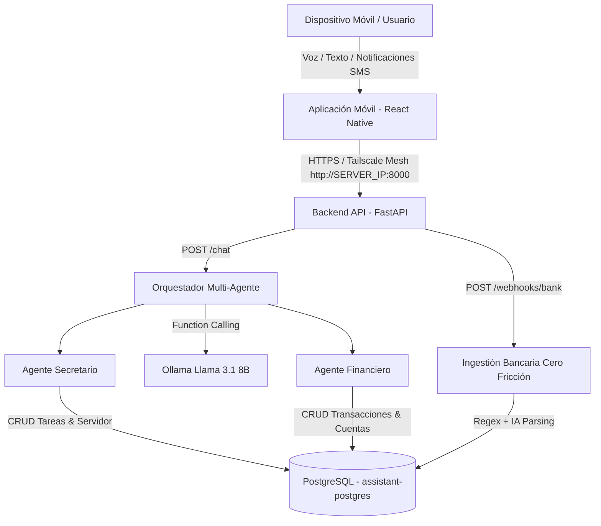

# Asistente Personal Inteligente Multi-Agente con Control por Voz

> **Asignatura:** Desarrollo de Aplicaciones Móviles (DAM)  
> **Proyecto:** Taller Segundo Corte: Asistente Personal Inteligente Multi-Agente, Ingestión Financiera Cero Fricción y Control por Voz.  
> **Servidor Host:** Servidor Linux / Docker (Debian/Ubuntu, 8+ vCPU, 16+ GB RAM recomendado)  
> **Conexión VPN:** Red Mesh Tailscale (`http://<SERVER_TAILSCALE_IP>:8000` / `http://localhost:8000`)

---

## Descripción General

El **Asistente Personal Inteligente Multi-Agente** es un sistema integral compuesto por una aplicación móvil (`front/`) y un backend orquestador (`back/`) desplegado en contenedores Docker. Permite gestionar tareas personales, obligaciones, estados del servidor y finanzas mediante interacción natural por voz, además de ofrecer **ingestión automática cero fricción** de notificaciones bancarias de dispositivos Android.

---

## Arquitectura del Sistema y Estructura de Directorios

El repositorio mantiene una separación clara de responsabilidades entre el frontend móvil y el backend servidor:

```text
assistant/
├── back/                      # [backend/] Servidor REST API, Agentes IA y Base de Datos
│   ├── app/
│   │   ├── agents/            # Agente Orquestador, Agente Secretario y Agente Financiero
│   │   │   ├── orchestrator.py
│   │   │   ├── secretary_agent.py
│   │   │   └── financial_agent.py
│   │   ├── bank_webhook.py    # Pipeline de ingestión cero fricción de notificaciones bancarias
│   │   ├── financial_manager.py # Servicio de persistencia y analítica financiera
│   │   ├── task_manager.py    # Servicio de persistencia de tareas y servidor
│   │   └── main.py            # Punto de entrada FastAPI REST
│   ├── compose.yml            # Orquestación Docker (FastAPI, PostgreSQL, Ollama)
│   ├── schema.sql             # Modelo relacional de PostgreSQL e índices
│   ├── requirements.txt       # Dependencias Python (FastAPI, psycopg, pydantic, ollama)
│   └── PROJECT_CONTEXT.md     # Documentación técnica extendida
│
└── front/                     # [mobile/] Aplicación Móvil React Native / Expo
    ├── App.tsx                # Punto de entrada de la app y navegación por pestañas
    ├── src/
    │   ├── api/               # Cliente HTTP (client.ts) configurado para Tailscale/Local
    │   ├── components/        # Componentes UI (Burbujas de voz, modales, encabezados)
    │   ├── screens/           # Pantallas: VoiceScreen, AssistantScreen, TasksScreen, FinancesScreen
    │   ├── services/          # Listener de notificaciones Android en segundo plano
    │   └── theme/             # Sistema de diseño, colores y tipografía
    ├── app.json               # Configuración de Expo
    └── package.json           # Dependencias React Native / Expo
```

---

## Flujo Arquitectónico General



---

## Instrucciones de Configuración y Despliegue

### 1. Prerrequisitos
- **Docker** & **Docker Compose** instalados en el servidor.
- **Node.js** (v18+) & **npm** en el equipo de desarrollo móvil.
- **Expo Go** o entorno Android en dispositivo móvil.
- **Tailscale** instalado y activo en el móvil y en el servidor host.

---

### 2. Despliegue del Backend (`back/`)

1. Navegar al directorio del backend:
   ```bash
   cd back
   ```

2. Crear/Verificar el archivo de variables de entorno `.env`:
   ```env
   POSTGRES_USER=assistant_user
   POSTGRES_PASSWORD=assistant_secure_pass
   POSTGRES_DB=assistant
   POSTGRES_HOST=assistant-postgres
   OLLAMA_HOST=http://ollama:11434
   OLLAMA_MODEL=llama3.1:8b
   ```

3. Levantar los servicios en contenedores Docker:
   ```bash
   docker compose up -d --build
   ```

4. Verificar que el backend esté operativo:
   ```bash
   curl http://localhost:8000/health
   # Respuesta esperada: {"status":"ok"}
   ```

---

### 3. Configuración y Ejecución del Frontend Móvil (`front/`)

1. Navegar al directorio del frontend:
   ```bash
   cd front
   ```

2. Instalar las dependencias de Node.js:
   ```bash
   npm install
   ```

3. Iniciar el servidor de desarrollo de Expo:
   ```bash
   npx expo start
   ```

4. Escanear el código QR desde la aplicación **Expo Go** en Android o ejecutar en un emulador Android conectado a la red del servidor.

---

## Endpoints Principales de la API Backend

| Método | Endpoint | Descripción |
|---|---|---|
| `GET` | `/health` | Verificación de salud del servicio. |
| `POST` | `/chat` | Interacción conversacional con el Orquestador Multi-Agente. |
| `POST` | `/webhooks/bank` | Ingestión cero fricción de notificaciones push/SMS bancarias. |
| `GET` / `POST` | `/tasks` | Listado y creación de tareas del sistema. |
| `GET` / `POST` | `/transactions` | Listado y registro manual de transacciones financieras. |
| `GET` / `POST` | `/accounts` | Consulta y creación de cuentas bancarias/efectivo. |

---

## Pruebas Rápidas

### Prueba del Orquestador Multi-Agente (`/chat`)
```bash
curl -X POST http://localhost:8000/chat \
  -H "Content-Type: application/json" \
  -d '{"message":"¿Qué tareas tengo pendientes y cuál es el resumen de mi flujo de caja?"}'
```

### Prueba de Ingestión Bancaria Cero Fricción (`/webhooks/bank`)
```bash
curl -X POST http://localhost:8000/webhooks/bank \
  -H "Content-Type: application/json" \
  -d '{"notification":"Compra aprobada en RAPPI por COP 48.500 con tu tarjeta bancaria terminada en 1234."}'
```

---

## Licencia y Entregables Académicos

Este repositorio forma parte de los entregables para la asignatura de **Desarrollo de Aplicaciones Móviles (DAM)**. El código fuente está comentado en sus secciones críticas para facilitar la evaluación y auditoría.
