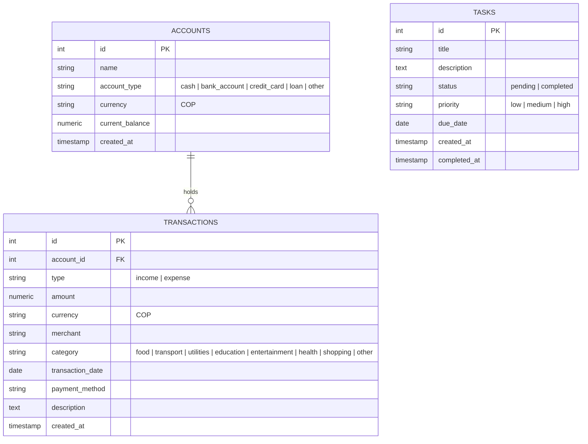
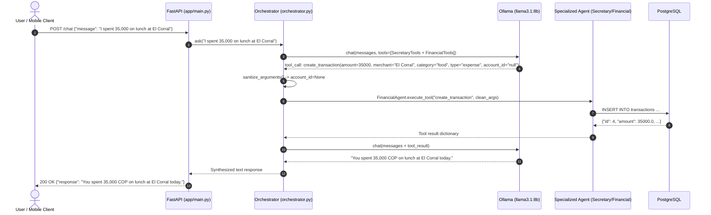
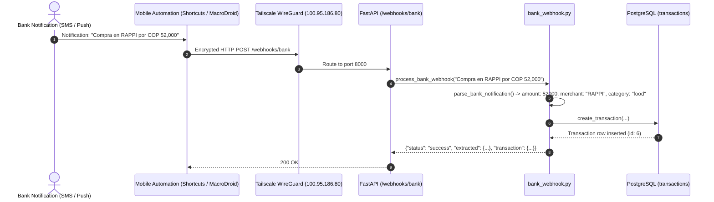

# Intelligent Multi-Agent Personal Assistant — Comprehensive Master Context & Reference

> **Purpose of this Document:**  
> This document is the definitive single source of truth for the **Intelligent Multi-Agent Personal Assistant** project. It is structured to provide complete architectural, operational, and contextual continuity for AI coding assistants, human developers, and evaluators. Keep this document updated whenever new capabilities are implemented.

---

## 1. Project Overview & Core Objectives

### 1.1 Academic Context
- **Course:** Desarrollo de Aplicaciones Móviles (DAM)
- **Assignment:** Taller Segundo Corte: Asistente Personal Inteligente Multi-Agente con Control por Voz
- **Host Server Name:** `abeja`
- **Operating System:** Debian 13 (Trixie) on x86_64
- **Hardware Profile:** AMD Ryzen 7 5825U PRO (8 cores / 16 threads), 32 GB DDR4 RAM, 500 GB NVMe SSD (system) + 4 TB HDD storage
- **Repository Location:** `/srv/docker/assistant`
- **Tailscale Mesh VPN Address:** `100.95.186.80`

### 1.2 Evaluation Rubric & Core Pillars
| Weight | Requirement Pillar | Objective & Deliverables |
|---|---|---|
| **25%** | **Mobile Application & Voice** | React Native / Expo mobile application with clean UX, microphone voice capture, speech-to-text (STT), conversational assistant screen, task manager, and finance dashboard. |
| **25%** | **Backend API & Multi-Agent** | FastAPI self-hosted orchestrator with specialized `SecretaryAgent` (tasks, calendar, server) and `FinancialAgent` (transactions, cash flow, accounts) powered by local LLM (`llama3.1:8b`). |
| **20%** | **Zero-Friction Banking Ingestion** | Ingestion pipeline where mobile push/SMS bank notifications are automatically intercepted and sent via Tailscale to `POST /webhooks/bank`, parsed using structured extraction, and stored in PostgreSQL. |
| **15%** | **Network Security & Tailscale Mesh** | Remote connectivity from mobile device (cellular/external Wi-Fi) to server without public router port forwarding, using Tailscale WireGuard mesh VPN. |
| **15%** | **Relational Database** | Normalized PostgreSQL relational model supporting tasks, accounts, transactions, and performance indexes. |

---

## 2. System Architecture & Logical Separation

### 2.1 Architectural Invariant
The project strictly separates layers. **Do NOT blend business logic across these boundaries:**

```text
┌─────────────────────────────────────────────────────────────┐
│                       MOBILE FRONTEND                       │
│    (React Native / Expo: Voice Capture, UI, Chat, State)    │
└──────────────────────────────┬──────────────────────────────┘
                               │ HTTPS / HTTP over Tailscale
                               │ (100.95.186.80:8000)
                               ▼
┌─────────────────────────────────────────────────────────────┐
│                      BACKEND REST API                       │
│       FastAPI + Pydantic Validation + Webhook Ingestion      │
└──────────────┬───────────────────────────────┬──────────────┘
               │                               │
        Deterministic REST             Conversational Intent
     (/tasks, /transactions, ...)              (/chat)
               │                               │
               ▼                               ▼
┌──────────────────────────────┐ ┌────────────────────────────┐
│      MANAGERS / SERVICES     │ │      AI ORCHESTRATOR       │
│  - task_manager.py           │ │   app/agents/orchestrator  │
│  - financial_manager.py      │ └─────────────┬──────────────┘
│  - bank_webhook.py           │               │
└──────────────┬───────────────┘       Function Calling
               │                        (Tools Dispatch)
               │                               │
               │               ┌───────────────┴──────────────┐
               │               ▼                              ▼
               │      ┌─────────────────┐            ┌─────────────────┐
               │      │ Secretary Agent │            │ Financial Agent │
               │      │  app/agents/    │            │  app/agents/    │
               │      │  secretary_agent│            │  financial_agent│
               │      └────────┬────────┘            └────────┬────────┘
               │               │                              │
               └───────────────┼──────────────────────────────┘
                               ▼
┌─────────────────────────────────────────────────────────────┐
│                    POSTGRESQL DATABASE                      │
│      assistant-postgres:5432 (Database: assistant)          │
└─────────────────────────────────────────────────────────────┘
```

### 2.2 Infrastructure Map
- **Docker Compose File:** [`compose.yml`](file:///srv/docker/assistant/compose.yml)
- **External Network:** `ai_default` (connects backend, PostgreSQL, and Ollama containers).
- **Internal Network:** `assistant-internal`
- **PostgreSQL Service:** `assistant-postgres` (Image: `postgres:18.6`, volume: `postgres_data:/var/lib/postgresql`).
- **Ollama Service:** Local Ollama running on host/Docker network at `http://ollama:11434` with model `llama3.1:8b`.
- **Backend Service:** `assistant` (Python 3.12, FastAPI, Uvicorn, port `127.0.0.1:8000:8000` bound to localhost and reachable via Tailscale `100.95.186.80:8000`).

---

## 3. Database Schema & Relational Data Model

All database tables are initialized via [`schema.sql`](file:///srv/docker/assistant/schema.sql).

### 3.1 Mermaid Entity-Relationship Diagram


### 3.2 SQL Table Definitions
```sql
-- Tasks table
CREATE TABLE IF NOT EXISTS tasks (
    id SERIAL PRIMARY KEY,
    title VARCHAR(255) NOT NULL,
    description TEXT,
    status VARCHAR(50) NOT NULL DEFAULT 'pending',
    priority VARCHAR(20) NOT NULL DEFAULT 'medium',
    due_date DATE,
    created_at TIMESTAMP WITH TIME ZONE DEFAULT CURRENT_TIMESTAMP,
    completed_at TIMESTAMP WITH TIME ZONE
);

-- Accounts table
CREATE TABLE IF NOT EXISTS accounts (
    id SERIAL PRIMARY KEY,
    name VARCHAR(255) NOT NULL,
    account_type VARCHAR(50) NOT NULL,
    currency VARCHAR(10) NOT NULL DEFAULT 'COP',
    current_balance NUMERIC(15, 2) NOT NULL DEFAULT 0.00,
    created_at TIMESTAMP WITH TIME ZONE DEFAULT CURRENT_TIMESTAMP
);

-- Transactions table
CREATE TABLE IF NOT EXISTS transactions (
    id SERIAL PRIMARY KEY,
    account_id INTEGER REFERENCES accounts(id) ON DELETE SET NULL,
    type VARCHAR(20) NOT NULL,
    amount NUMERIC(15, 2) NOT NULL,
    currency VARCHAR(10) NOT NULL DEFAULT 'COP',
    merchant VARCHAR(255),
    category VARCHAR(50) NOT NULL DEFAULT 'other',
    transaction_date DATE NOT NULL DEFAULT CURRENT_DATE,
    payment_method VARCHAR(100),
    description TEXT,
    created_at TIMESTAMP WITH TIME ZONE DEFAULT CURRENT_TIMESTAMP
);

-- Indexes for frequent queries
CREATE INDEX IF NOT EXISTS idx_tasks_status ON tasks(status);
CREATE INDEX IF NOT EXISTS idx_tasks_due_date ON tasks(due_date);
CREATE INDEX IF NOT EXISTS idx_transactions_type ON transactions(type);
CREATE INDEX IF NOT EXISTS idx_transactions_category ON transactions(category);
CREATE INDEX IF NOT EXISTS idx_transactions_date ON transactions(transaction_date);
```

---

## 4. Current Implementation Status (Phases 1–4 Completed)

### ✅ Phase 1: Database Initialization & Robust Connection
- **Files:** [`schema.sql`](file:///srv/docker/assistant/schema.sql), [`compose.yml`](file:///srv/docker/assistant/compose.yml), [`app/task_manager.py`](file:///srv/docker/assistant/app/task_manager.py), [`app/financial_manager.py`](file:///srv/docker/assistant/app/financial_manager.py).
- **Capabilities:**
  - Standard DDL with primary keys, foreign keys, constraints, and indexes.
  - Database URL constructed dynamically with environment variable fallbacks (`POSTGRES_USER`, `POSTGRES_PASSWORD`, `POSTGRES_HOST`, `POSTGRES_DB`).
  - Safe lazy psycopg import with graceful exception handling.

### ✅ Phase 2: Secretary Agent & Task Manager
- **Files:** [`app/task_manager.py`](file:///srv/docker/assistant/app/task_manager.py), [`app/agents/secretary_agent.py`](file:///srv/docker/assistant/app/agents/secretary_agent.py), [`app/tools.py`](file:///srv/docker/assistant/app/tools.py).
- **Capabilities:**
  - Full CRUD: `create_task`, `get_tasks` (filtering by status, start_date, end_date), `get_task` (by ID), `find_tasks` (partial title search), `update_task`, `complete_task`, `delete_task`.
  - System server diagnostics tool: `get_server_status()` returning hostname and disk usage.
  - Strict system prompt guardrails: treats tool data as source of truth; explicitly mentions when tasks have no due date; never hallucinates due dates.

### ✅ Phase 3: Financial Agent & Analytical Tools
- **Files:** [`app/financial_manager.py`](file:///srv/docker/assistant/app/financial_manager.py), [`app/agents/financial_agent.py`](file:///srv/docker/assistant/app/agents/financial_agent.py).
- **Capabilities:**
  - Transactions CRUD: `create_transaction`, `get_transactions`, `get_transaction`, `update_transaction`, `delete_transaction`.
  - Accounts CRUD: `create_account`, `get_accounts`, `get_account`, `update_account`, `delete_account`.
  - Analytics & Cash Flow:
    - `get_cash_flow(start_date, end_date)`: Calculates total income, total expenses, and net cash flow (`income - expenses`).
    - `get_spending_by_category(category, start_date, end_date)`: Aggregates total expense per category in descending order.
  - Defensive Normalization: Helpers `normalize_optional_int`, `normalize_optional_str`, and `normalize_optional_date` prevent PostgreSQL text-representation errors when the LLM emits `"null"`, `"none"`, or empty strings for integer columns.

### ✅ Phase 4: Multi-Agent Orchestrator Architecture
- **Files:** [`app/agents/orchestrator.py`](file:///srv/docker/assistant/app/agents/orchestrator.py), [`app/agents/__init__.py`](file:///srv/docker/assistant/app/agents/__init__.py), [`app/agent.py`](file:///srv/docker/assistant/app/agent.py).
- **Capabilities:**
  - `OrchestratorAgent` registers tools from both `SecretaryAgent` and `FinancialAgent`.
  - `sanitize_arguments(arguments)` strips `"null"`/`"none"` strings before dispatching.
  - Directs tool calls to the matching agent, sends structured results back to Ollama, and synthesizes a natural language response.
  - Legacy entry point [`app/agent.py`](file:///srv/docker/assistant/app/agent.py) acts as a clean backward-compatible proxy.

### ✅ Phase 5: Zero-Friction Banking Webhook
- **Files:** [`app/bank_webhook.py`](file:///srv/docker/assistant/app/bank_webhook.py), [`app/main.py`](file:///srv/docker/assistant/app/main.py).
- **Capabilities:**
  - Endpoint: `POST /webhooks/bank`.
  - Ingests raw bank SMS / push notifications (e.g., `"Compra aprobada en RAPPI por COP 52,000 con tu tarjeta..."`).
  - Robust regex pattern parsing:
    - Extracts amounts (handles thousands separators `,` and `.` properly).
    - Identifies transaction type (`expense` vs `income`).
    - Identifies merchant and assigns intelligent category heuristics (`food`, `transport`, `utilities`, `shopping`, etc.).
  - Inserts the verified transaction into PostgreSQL and returns structured confirmation.

### ✅ Phase 6: Automated Test Suite
- **Directory:** [`tests/`](file:///srv/docker/assistant/tests/)
- **Modules Tested:**
  - `tests/test_task_manager.py` (10 tests)
  - `tests/test_financial_manager.py` (8 tests)
  - `tests/test_tools.py` (1 test)
  - `tests/test_multi_agent.py` (6 tests)
  - `tests/test_bank_webhook.py` (3 tests)
  - `tests/test_api.py` (5 tests)
- **Test Command:** `python3 -m unittest discover -s tests -p "test_*.py"` (All tests pass 100%).

---

## 5. Sequence Flows & Operational Mechanics

### 5.1 Natural Language Chat Flow (`POST /chat`)


### 5.2 Zero-Friction Banking Webhook Flow (`POST /webhooks/bank`)


---

## 6. Complete API Reference & Documentation

Base URLs:
- **Local Server:** `http://127.0.0.1:8000`
- **Tailscale Remote:** `http://100.95.186.80:8000`

### 6.1 Endpoints Summary Table
| Method | Endpoint | Description | Auth Required |
|---|---|---|---|
| `GET` | `/health` | Server liveness probe | None |
| `POST` | `/chat` | Conversational multi-agent interface | Optional API key |
| `POST` | `/webhooks/bank` | Automated bank notification ingestion | None / Token |
| `GET` | `/tasks` | List tasks (optional status & date filters) | Optional API key |
| `POST` | `/tasks` | Create task via structured payload | Optional API key |
| `GET` | `/tasks/{task_id}` | Retrieve specific task by ID | Optional API key |
| `POST` | `/tasks/{task_id}/complete` | Mark task as completed | Optional API key |
| `DELETE` | `/tasks/{task_id}` | Permanently delete task | Optional API key |
| `GET` | `/transactions` | List transactions with filters | Optional API key |
| `POST` | `/transactions` | Create transaction via structured payload | Optional API key |
| `GET` | `/accounts` | List all financial accounts | Optional API key |
| `POST` | `/accounts` | Create financial account | Optional API key |

---

### 6.2 Endpoint Detailed Specifications

#### 1. System Health (`GET /health`)
- **Request:**
  ```bash
  curl -s http://127.0.0.1:8000/health
  ```
- **Response (200 OK):**
  ```json
  {
    "status": "ok"
  }
  ```

---

#### 2. Multi-Agent Conversational Chat (`POST /chat`)
- **Headers:** `Content-Type: application/json`
- **Body Schema:**
  ```json
  {
    "message": "string (Required. Natural language query or command)"
  }
  ```
- **Example Request:**
  ```bash
  curl -s -X POST http://127.0.0.1:8000/chat \
    -H "Content-Type: application/json" \
    -d '{"message": "What tasks do I have pending?"}'
  ```
- **Response (200 OK):**
  ```json
  {
    "response": "You have the following tasks pending:\n\n1. Submit systems engineering assignment (due on 2026-09-20, priority: high)\n2. Prepare slide deck for DAM class (due on 2026-09-25, priority: high)\n3. Buy groceries (no due date, priority: medium)"
  }
  ```

---

#### 3. Banking Webhook Ingestion (`POST /webhooks/bank`)
- **Headers:** `Content-Type: application/json`
- **Body Schema:**
  ```json
  {
    "notification": "string (Required. Raw notification/SMS text from bank)"
  }
  ```
- **Example Request:**
  ```bash
  curl -s -X POST http://127.0.0.1:8000/webhooks/bank \
    -H "Content-Type: application/json" \
    -d '{"notification": "Compra aprobada en RAPPI por COP 52,000 con tu tarjeta terminada en 4321."}'
  ```
- **Response (200 OK):**
  ```json
  {
    "status": "success",
    "extracted": {
      "type": "expense",
      "amount": 52000.0,
      "currency": "COP",
      "merchant": "RAPPI",
      "category": "food",
      "description": "Automated ingestion: Compra aprobada en RAPPI por COP 52,000 con tu tarjeta terminada en 4321."
    },
    "transaction": {
      "id": 6,
      "account_id": null,
      "type": "expense",
      "amount": 52000.0,
      "currency": "COP",
      "merchant": "RAPPI",
      "category": "food",
      "transaction_date": "2026-09-17",
      "payment_method": null,
      "description": "Automated ingestion: Compra aprobada en RAPPI por COP 52,000 con tu tarjeta terminada en 4321.",
      "created_at": "2026-09-17T23:41:58.317204+00:00"
    }
  }
  ```

---

#### 4. Tasks REST API
- **List Tasks (`GET /tasks`):**
  - Query Parameters:
    - `status` (`pending` | `completed`, optional)
    - `start_date` (`YYYY-MM-DD`, optional)
    - `end_date` (`YYYY-MM-DD`, optional)
  - Example: `curl -s http://127.0.0.1:8000/tasks?status=pending`
  - Response (200 OK):
    ```json
    [
      {
        "id": 3,
        "title": "Submit systems engineering assignment",
        "description": null,
        "status": "pending",
        "priority": "high",
        "due_date": "2026-09-20",
        "created_at": "2026-09-15T04:26:43.122966"
      }
    ]
    ```
- **Create Task (`POST /tasks`):**
  ```bash
  curl -s -X POST http://127.0.0.1:8000/tasks \
    -H "Content-Type: application/json" \
    -d '{
      "title": "Study for Mobile Apps Exam",
      "description": "Review React Native and Multi-Agent notes",
      "due_date": "2026-09-28",
      "priority": "high"
    }'
  ```
- **Complete Task (`POST /tasks/{id}/complete`):**
  ```bash
  curl -s -X POST http://127.0.0.1:8000/tasks/3/complete
  ```
- **Delete Task (`DELETE /tasks/{id}`):**
  ```bash
  curl -s -X DELETE http://127.0.0.1:8000/tasks/3
  ```

---

#### 5. Transactions REST API
- **List Transactions (`GET /transactions`):**
  - Query Parameters: `type` (`income` | `expense`), `category`, `start_date`, `end_date`.
  - Example: `curl -s http://127.0.0.1:8000/transactions?type=expense`
  - Response (200 OK):
    ```json
    [
      {
        "id": 6,
        "account_id": null,
        "type": "expense",
        "amount": 52000.0,
        "currency": "COP",
        "merchant": "RAPPI",
        "category": "food",
        "transaction_date": "2026-09-17",
        "payment_method": null,
        "description": "Automated ingestion: Compra aprobada en RAPPI...",
        "created_at": "2026-09-17T23:41:58.317204+00:00"
      }
    ]
    ```
- **Create Transaction (`POST /transactions`):**
  ```bash
  curl -s -X POST http://127.0.0.1:8000/transactions \
    -H "Content-Type: application/json" \
    -d '{
      "type": "expense",
      "amount": 12500.0,
      "currency": "COP",
      "merchant": "Transmilenio",
      "category": "transport",
      "payment_method": "card"
    }'
  ```

---

#### 6. Accounts REST API
- **List Accounts (`GET /accounts`):**
  ```bash
  curl -s http://127.0.0.1:8000/accounts
  ```
  Response (200 OK):
  ```json
  [
    {
      "id": 1,
      "name": "Main Bank Account",
      "account_type": "bank_account",
      "currency": "COP",
      "current_balance": 1500000.0,
      "created_at": "2026-09-15T23:44:32.970511+00:00"
    }
  ]
  ```
- **Create Account (`POST /accounts`):**
  ```bash
  curl -s -X POST http://127.0.0.1:8000/accounts \
    -H "Content-Type: application/json" \
    -d '{
      "name": "Cash Wallet",
      "account_type": "cash",
      "currency": "COP",
      "current_balance": 50000.0
    }'
  ```

---

## 7. Implementation Roadmap for Remaining Phases

```text
┌─────────────────────────────────────────────────────────────┐
│             PHASE 5: Mobile Frontend Application            │
│         React Native (Expo + TypeScript) in mobile/         │
└──────────────────────────────┬──────────────────────────────┘
                               ▼
┌─────────────────────────────────────────────────────────────┐
│            PHASE 6: Voice Control & Audio Layer             │
│        Push-to-talk recording, speech-to-text, TTS          │
└──────────────────────────────┬──────────────────────────────┘
                               ▼
┌─────────────────────────────────────────────────────────────┐
│          PHASE 7: Zero-Friction Mobile Automation           │
│        Android (MacroDroid/Tasker) or iOS (Shortcuts)       │
└──────────────────────────────┬──────────────────────────────┘
                               ▼
┌─────────────────────────────────────────────────────────────┐
│       PHASE 8: Security, Documentation & Video Demo         │
│          Tailscale verification, demo recording             │
└─────────────────────────────────────────────────────────────┘
```

---

### 7.1 Phase 5: Mobile Frontend Application (`mobile/`)

#### Objective
Build a cross-platform mobile client using **React Native with Expo SDK (TypeScript)** adhering strictly to the clean, non-overloaded UI guidelines.

#### Proposed Directory Structure
```text
/srv/docker/assistant/
├── mobile/
│   ├── App.tsx
│   ├── app.json
│   ├── package.json
│   ├── tsconfig.json
│   └── src/
│       ├── api/
│       │   ├── client.ts             # Axios client configured to http://100.95.186.80:8000
│       │   ├── assistantApi.ts       # chat endpoint caller
│       │   ├── tasksApi.ts           # tasks CRUD caller
│       │   └── financeApi.ts         # transactions & accounts caller
│       ├── navigation/
│       │   └── RootNavigator.tsx     # Bottom tabs: Assistant, Tasks, Finances
│       ├── screens/
│       │   ├── AssistantScreen.tsx   # Chat bubble list + voice mic button + text input
│       │   ├── TasksScreen.tsx       # Filterable task list with checkboxes & add modal
│       │   └── FinancesScreen.tsx    # Balance cards, cash-flow summary, recent expenses
│       ├── components/
│       │   ├── VoiceMicButton.tsx    # Animated record button with pulsing wave effect
│       │   ├── TaskItem.tsx          # Task card with priority pill & complete action
│       │   └── TransactionItem.tsx   # Expense/Income row with category badge
│       ├── theme/
│       │   └── colors.ts             # Modern minimalist palette (slate/dark mode, clean typography)
│       └── utils/
│           └── formatters.ts         # Currency COP formatting, relative dates
```

#### Step-by-Step Execution Plan
1. **Initialize Expo App in `mobile/`**:
   ```bash
   npx -y create-expo-app@latest mobile --template blank-typescript
   ```
2. **Install Core Dependencies**:
   ```bash
   cd mobile
   npx expo install @react-navigation/native @react-navigation/bottom-tabs react-native-screens react-native-safe-area-context
   npx expo install expo-av expo-speech axios
   ```
3. **Configure API Client**:
   Target `http://100.95.186.80:8000` with configurable fallback to localhost or custom IP in developer settings.
4. **Implement Screens**:
   - `AssistantScreen`: Conversational stream with user and AI messages.
   - `TasksScreen`: Clean checklist; toggle complete; delete swipe; priority color coding.
   - `FinancesScreen`: Net cash flow KPI card, balance list, recent transaction feed.

---

### 7.2 Phase 6: Voice Control & Audio Layer

#### Objective
Demonstrate voice-driven assistant interaction satisfying the 25% mobile requirement:
```text
Press Microphone -> Record Audio -> Transcribe to Text -> Send to /chat -> Synthesize Speech / Display Answer
```

#### Architecture Options
1. **Client-Side Native Speech Recognition (Recommended):**
   - Use `expo-speech-recognition` or `@react-native-voice/voice`.
   - Transcribes voice directly on mobile hardware into Spanish/English text with **zero server transcription latency**.
   - Sends transcribed prompt text directly to `POST /chat`.
   - Reads back AI response using `expo-speech` (`Speech.speak(response, { language: 'es' })`).
2. **Server-Side Audio Whisper (Alternative):**
   - Mobile sends recorded `.m4a` audio file to backend endpoint `POST /audio/transcribe`.
   - Backend runs lightweight Whisper model or calls local inference, then pipes text to orchestrator.

#### Step-by-Step Execution Plan
1. Add microphone permissions to `mobile/app.json`:
   ```json
   {
     "expo": {
       "plugins": [
         [
           "expo-av",
           {
             "microphonePermission": "Allow assistant to record voice for commands."
           }
         ]
       ]
     }
   }
   ```
2. Create `VoiceMicButton.tsx`:
   - `onPressIn`: Start recording audio buffer via `Audio.Recording.createAsync()`.
   - `onPressOut`: Stop recording, get local URI or transcribed text, send to `/chat`.
3. Add Text-To-Speech playback toggle in assistant screen.

---

### 7.3 Phase 7: Zero-Friction Mobile Banking Automation

#### Objective
Fulfill the 20% "Zero-Friction Banking" requirement by implementing one concrete mobile automation path that intercepts incoming bank messages and forwards them to the server webhook.

#### Supported Mobile Automation Paths

##### Option A: Android (MacroDroid or Tasker) — Recommended for Android
1. **Trigger:** Notification Received from target apps (e.g., `com.bancolombia.personas`, `co.com.davivienda`, `com.nequi.MobileApp`).
2. **Action:** HTTP Request:
   - Method: `POST`
   - URL: `http://100.95.186.80:8000/webhooks/bank`
   - Header: `Content-Type: application/json`
   - Request Body: `{"notification": "{notification_text}"}`
3. **Constraint:** Runs in background over Tailscale VPN connection.

##### Option B: iOS (Apple Shortcuts Automation) — Recommended for iPhone
1. **Trigger:** "When I receive a message containing 'Compra' or 'Transferencia' or from Bank Sender".
2. **Action:**
   - Text action: Shortcut Input.
   - "Get Contents of URL":
     - URL: `http://100.95.186.80:8000/webhooks/bank`
     - Method: `POST`
     - Headers: `Content-Type: application/json`
     - Request Body (JSON): Key `notification`, Value `Shortcut Input`.

---

### 7.4 Phase 8: Security, Documentation & Demonstration Video

#### Security Hardening
1. Ensure the backend only binds to `127.0.0.1` and `100.95.186.80` (Tailscale) rather than public interfaces `0.0.0.0` exposed to the router WAN.
2. Add an optional API Key middleware (`X-Assistant-Token`) in `app/main.py` validated against an environment secret `ASSISTANT_API_KEY`.
3. Ensure PostgreSQL port `5432` remains internal to the Docker network `ai_default` and never exposed on host ports.

#### Final Submission Deliverables
1. **Repository Organization:**
   ```text
   /srv/docker/assistant/
   ├── backend/ (or app/)
   ├── mobile/
   ├── schema.sql
   ├── compose.yml
   ├── PROJECT_CONTEXT.md
   └── README.md
   ```
2. **3–5 Minute Video Demo Script:**
   - **Minute 0:00–0:45 (Architecture & Tailscale):** Show server `abeja`, Docker containers running, phone disconnected from home Wi-Fi (on LTE/5G), Tailscale connected to `100.95.186.80`.
   - **Minute 0:45–1:45 (Secretary Voice Commands):** Press mic, say `"Crea una tarea urgente para entregar taller de DAM el viernes"`. Show task appearing on phone screen and verified in PostgreSQL.
   - **Minute 1:45–2:45 (Financial Voice Commands):** Press mic, say `"Gasté 35000 en el almuerzo hoy"`. Show transaction recorded, cash-flow updated. Ask `"¿Cuánto he gastado en comida?"` and hear/read AI reply.
   - **Minute 2:45–3:45 (Zero-Friction Banking Webhook):** Trigger bank notification simulation on phone. Show webhook hit, transaction parsed automatically, notification displayed on mobile screen without manual entry.

---

## 8. Repository File Inventory

| File Path | Description |
|---|---|
| [`compose.yml`](file:///srv/docker/assistant/compose.yml) | Docker Compose services (`assistant` and `assistant-postgres`), network definitions, and volume mounts. |
| [`Dockerfile`](file:///srv/docker/assistant/Dockerfile) | Container image build for FastAPI backend. |
| [`requirements.txt`](file:///srv/docker/assistant/requirements.txt) | Python dependencies: `fastapi`, `uvicorn`, `psycopg`, `ollama`, `pytest`, `httpx`. |
| [`schema.sql`](file:///srv/docker/assistant/schema.sql) | Idempotent PostgreSQL DDL for `tasks`, `accounts`, and `transactions` tables and indexes. |
| [`app/main.py`](file:///srv/docker/assistant/app/main.py) | FastAPI app entry point exposing `/health`, `/chat`, `/webhooks/bank`, and REST endpoints. |
| [`app/agent.py`](file:///srv/docker/assistant/app/agent.py) | Legacy proxy forwarding to `app/agents/orchestrator.py`. |
| [`app/agents/orchestrator.py`](file:///srv/docker/assistant/app/agents/orchestrator.py) | Root AI Orchestrator: aggregates tools, sanitizes arguments, calls Ollama `llama3.1:8b`, and synthesizes response. |
| [`app/agents/secretary_agent.py`](file:///srv/docker/assistant/app/agents/secretary_agent.py) | Specialized Secretary Agent for tasks and server diagnostics. |
| [`app/agents/financial_agent.py`](file:///srv/docker/assistant/app/agents/financial_agent.py) | Specialized Financial Agent for transactions, accounts, cash-flow, and category spending. |
| [`app/task_manager.py`](file:///srv/docker/assistant/app/task_manager.py) | PostgreSQL CRUD operations for tasks. |
| [`app/financial_manager.py`](file:///srv/docker/assistant/app/financial_manager.py) | PostgreSQL CRUD operations for accounts, transactions, cash-flow, and category spending. |
| [`app/bank_webhook.py`](file:///srv/docker/assistant/app/bank_webhook.py) | Regex and structured extraction parser for incoming bank notifications. |
| [`app/tools.py`](file:///srv/docker/assistant/app/tools.py) | System tools (`get_server_status`). |
| [`tests/test_task_manager.py`](file:///srv/docker/assistant/tests/test_task_manager.py) | Unit tests for task management functions. |
| [`tests/test_financial_manager.py`](file:///srv/docker/assistant/tests/test_financial_manager.py) | Unit tests for financial transactions, accounts, and cash-flow math. |
| [`tests/test_tools.py`](file:///srv/docker/assistant/tests/test_tools.py) | Unit tests for server status tools. |
| [`tests/test_multi_agent.py`](file:///srv/docker/assistant/tests/test_multi_agent.py) | Unit tests for orchestrator routing, tool aggregation, and sanitization. |
| [`tests/test_bank_webhook.py`](file:///srv/docker/assistant/tests/test_bank_webhook.py) | Unit tests for bank notification text parser. |
| [`tests/test_api.py`](file:///srv/docker/assistant/tests/test_api.py) | API endpoint tests for FastAPI endpoints. |
| [`PROJECT_CONTEXT.md`](file:///srv/docker/assistant/PROJECT_CONTEXT.md) | **This master reference and contextual continuity document.** |

---

## 9. Operations & Troubleshooting Handbook

### 9.1 Container Management
```bash
# Check running containers
sudo docker ps

# Rebuild and restart backend container after changes
sudo docker compose up -d --build assistant

# View live backend logs
sudo docker logs -f assistant

# Check PostgreSQL tables directly
sudo docker exec -it assistant-postgres psql -U assistant -d assistant -c "\dt"

# Check transaction rows directly
sudo docker exec -it assistant-postgres psql -U assistant -d assistant -c "SELECT id, type, amount, merchant, category, transaction_date FROM transactions ORDER BY id DESC LIMIT 10;"
```

### 9.2 Running Automated Tests
```bash
# Run entire test suite
python3 -m unittest discover -s tests -p "test_*.py"

# Run specific module tests
python3 -m unittest tests/test_task_manager.py
python3 -m unittest tests/test_financial_manager.py
python3 -m unittest tests/test_bank_webhook.py
python3 -m unittest tests/test_multi_agent.py
```

### 9.3 Key Lessons & Known Gotchas
1. **Docker Container Code Syncing:**  
   The `compose.yml` mounts `./app:/app`. If files are added at the root level (such as new packages), remember to execute `sudo docker compose up -d --build assistant` so imports resolve properly inside the container.
2. **LLM Argument String Litter:**  
   LLMs calling function tools frequently serialize `null` as string `"null"` or `"none"` instead of actual JSON `null`. Always run arguments through `sanitize_arguments()` in [`orchestrator.py`](file:///srv/docker/assistant/app/agents/orchestrator.py) and normalization helpers in [`financial_manager.py`](file:///srv/docker/assistant/app/financial_manager.py) to prevent PostgreSQL `invalid input syntax for type integer: "null"` errors.
3. **Internal vs External Ports:**  
   PostgreSQL port `5432` is strictly internal to the Docker network `ai_default`. Only FastAPI (`8000`) is bound to `127.0.0.1` and accessible over the Tailscale VPN (`100.95.186.80`).
